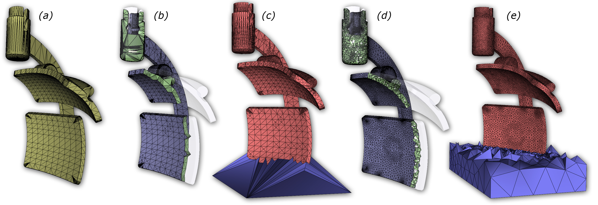

# CDT - Constrained Delaunay Tetrahedrization made robust and practical
This code implements an algorithm to calculate a Constrained Delaunay Tetrahedrization (CDT) of an input PLC represented by on OFF file.
Steiner points are possibly added to make the input admit a CDT.
Details of the algorithm are described in "**Constrained Delaunay Tetrahedrization: A robust and practical approach**" by L. Diazzi, D. Panozzo, A. Vaxman and M. Attene (ACM Trans Graphics Vol 42, N. 6, Procs of SIGGRAPH Asia 2023). 
You may download a copy here: http://arxiv.org/abs/2309.09805

<p align="center"></p>

## Usage
Clone this repository with:
```
git clone https://github.com/MarcoAttene/CDT
```

Once done, you may build the executable as follows:
```
cmake -B build -S .
```

This will produce an appropriate building configuration for your system.
On Windows MSVC, this will produce a cdt.sln file.
On Linux/MacOS, this will produce a Makefile. 
Use it as usual to compile cdt. Alternatively, you can use the command line:
```
cmake --build build --config Release
```

When compiled, the code generates an executable called ``cdt``.
Launch it with no command line parameters to have a list of supported options.

Example:

```
cdt input_file.off
```
creates a file called ``input_file.off.tet`` representing the constrained tetrahedrization.


We tested our code on Linux (GCC-11), MacOS (GCC-11 and CLANG) and Windows (MSVC 2022 with both CL and CLANG).

## License
This program is distributed under the terms of either the GNU GPL or the GNU LGPL license.
The code can be compiled in two ways, depending on how CMake is invoked.
If you build using ``CMake -DLGPL=ON ..``, you may choose between GPL and LGPL at your option.
If you build using ``CMake -DLGPL=OFF ..`` or just ``CMake ..``, the code makes use of modified 
parts of a third-party code which requires you to accept the terms of the GPL license.
See ``src/delaunay.h`` for details.

In either case, the program is distributed in the hope that it will be      
useful, but WITHOUT ANY WARRANTY; without even the implied warranty of   
MERCHANTABILITY or FITNESS FOR A PARTICULAR PURPOSE.
